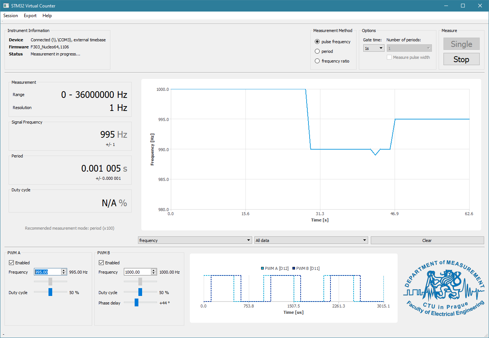

# Virtuální Čítač na platformě STM32

<style>
a.button, a.button:visited {
    display: inline-block;
    padding: 0.5em 1.2em;
    text-align: left;
    border-radius: 0.5em;

    background: #1756a9;
    color: #fff;
}

a.button:hover, a.button:active {
    background: #3776c9;
    color: #fff;

    text-decoration: none;
}

hr {
    border: none;
    border-top: 1px solid #ddd;
    margin: 2em 0em 2em 0em;
}

.button hr {
    margin: 0.3em 0em 0.3em 0em;
}
</style>

<div style="text-align: center">
<a href="https://github.com/mcejp/virtual-counter/releases/download/v21.02/virtual-counter-21.02.zip" class="button">
<div style="display: flex; flex-direction: row; align-items: center">
    <div style="margin-right: 1.5em">
        <svg version="1.1" xmlns="http://www.w3.org/2000/svg" xmlns:xlink="http://www.w3.org/1999/xlink" height="3.5em" viewBox="0 0 438.533 438.533" style="display: block; fill: #fff" xml:space="preserve"><g><path d="M409.133,109.203c-19.608-33.592-46.205-60.189-79.798-79.796C295.736,9.801,259.058,0,219.273,0 c-39.781,0-76.47,9.801-110.063,29.407c-33.595,19.604-60.192,46.201-79.8,79.796C9.801,142.8,0,179.489,0,219.267 c0,39.78,9.804,76.463,29.407,110.062c19.607,33.592,46.204,60.189,79.799,79.798c33.597,19.605,70.283,29.407,110.063,29.407 s76.47-9.802,110.065-29.407c33.593-19.602,60.189-46.206,79.795-79.798c19.603-33.596,29.403-70.284,29.403-110.062 C438.533,179.485,428.732,142.795,409.133,109.203z M353.742,297.208c-13.894,23.791-32.736,42.633-56.527,56.534 c-23.791,13.894-49.771,20.834-77.945,20.834c-28.167,0-54.149-6.94-77.943-20.834c-23.791-13.901-42.633-32.743-56.527-56.534 c-13.897-23.791-20.843-49.772-20.843-77.941c0-28.171,6.949-54.152,20.843-77.943c13.891-23.791,32.738-42.637,56.527-56.53 c23.791-13.895,49.772-20.84,77.943-20.84c28.173,0,54.154,6.945,77.945,20.84c23.791,13.894,42.634,32.739,56.527,56.53 c13.895,23.791,20.838,49.772,20.838,77.943C374.58,247.436,367.637,273.417,353.742,297.208z"/><path d="M310.633,219.267H255.82V118.763c0-2.666-0.862-4.853-2.573-6.567c-1.704-1.709-3.895-2.568-6.557-2.568h-54.823 c-2.664,0-4.854,0.859-6.567,2.568c-1.714,1.715-2.57,3.901-2.57,6.567v100.5h-54.819c-4.186,0-7.042,1.905-8.566,5.709 c-1.524,3.621-0.854,6.947,1.999,9.996l91.363,91.361c2.096,1.711,4.283,2.567,6.567,2.567c2.281,0,4.471-0.856,6.569-2.567 l91.077-91.073c1.902-2.283,2.851-4.576,2.851-6.852c0-2.662-0.855-4.853-2.573-6.57 C315.489,220.122,313.299,219.267,310.633,219.267z"/></g></svg>
    </div>
    <div>
        <strong style="font-size: 130%">Stáhnout v21.02</strong>
        <div>&ndash; Aplikace pro Windows (MeasurementTool)</div>
        <div>&ndash; Firmware pro podporované platformy</div>
    </div>
</div>
</a>
</div>

&nbsp;



---

## Podporované hardwarové platformy

<!-- <svg version="1.1" xmlns="http://www.w3.org/2000/svg" xmlns:xlink="http://www.w3.org/1999/xlink" x="0px" y="0px" viewBox="0 0 32 32" xml:space="preserve" height="1.5em"><style type="text/css">.st0{fill:none;stroke:#000000;stroke-width:2;stroke-linecap:round;stroke-linejoin:round;stroke-miterlimit:10;}</style><path d="M29,15c0.6,0,1-0.4,1-1s-0.4-1-1-1h-3v-2h3c0.6,0,1-0.4,1-1s-0.4-1-1-1h-3c0-1.7-1.3-3-3-3V3c0-0.6-0.4-1-1-1s-1,0.4-1,1v3 h-2V3c0-0.6-0.4-1-1-1s-1,0.4-1,1v3h-2V3c0-0.6-0.4-1-1-1s-1,0.4-1,1v3h-2V3c0-0.6-0.4-1-1-1S9,2.4,9,3v3C7.3,6,6,7.3,6,9H3 c-0.6,0-1,0.4-1,1s0.4,1,1,1h3v2H3c-0.6,0-1,0.4-1,1s0.4,1,1,1h3v2H3c-0.6,0-1,0.4-1,1s0.4,1,1,1h3v2H3c-0.6,0-1,0.4-1,1s0.4,1,1,1 h3c0,1.7,1.3,3,3,3v3c0,0.6,0.4,1,1,1s1-0.4,1-1v-3h2v3c0,0.6,0.4,1,1,1s1-0.4,1-1v-3h2v3c0,0.6,0.4,1,1,1s1-0.4,1-1v-3h2v3 c0,0.6,0.4,1,1,1s1-0.4,1-1v-3c1.7,0,3-1.3,3-3h3c0.6,0,1-0.4,1-1s-0.4-1-1-1h-3v-2h3c0.6,0,1-0.4,1-1s-0.4-1-1-1h-3v-2H29z M22,19 c0,1.7-1.3,3-3,3h-6c-1.7,0-3-1.3-3-3v-6c0-1.7,1.3-3,3-3h6c1.7,0,3,1.3,3,3V19z"/></svg> -->

Mikrokontrolér/kit|Název firmware|Zdroj časové základny|Zapojení
-|-|-|-
STM32F042F6 (samostatně)|<code><nobr>fw-STM32F042F6-USB_CDC</nobr></code>|interní oscilátor HSI, dolaďován podle USB|[zde](virtual-counter-pinouts.html#stm32f042f6-stand-alone)
[NUCLEO-F042K6](https://www.st.com/en/evaluation-tools/nucleo-f042k6.html)|<code><nobr>fw-STM32F042K6-VCP</nobr></code>|interní oscilátor HSI nebo 8MHz krystal připojený mezi piny D7 a D8 (detekován při zapnutí)|[zde](virtual-counter-pinouts.html#nucleo-f042k6)
[NUCLEO-F303RE](https://www.st.com/en/evaluation-tools/nucleo-f303re.html)|<code><nobr>fw-STM32F303RE</nobr></code>|krystal integrovaný na kitu|[zde](virtual-counter-pinouts.html#nucleo-f303re)

Firmware je k dispozici ve formátech BIN, HEX a ELF.

## Podporované operační systémy

OS|Vyžaduje instalaci ovladače?
-|-
Windows 10|ne
Windows Vista/7/8/8.1|možná (viz níže)
Windows XP|ano (viz níže)
macOS 10.12 a novější|ne
Linux 3.0 a novější|ne

### Instalace na Windows Vista/7/8/8.1

Windows Update ve Windows Vista by měl potřebný ovladač od STMicroelectronics nainstalovat automaticky.

### Installace na Windows XP

Windows XP neobsahuje potřebný ovladač pro zařízení typu USB CDC. Doporučujeme použít [STM32 Virtual COM Port Driver](http://www.st.com/en/development-tools/stsw-stm32102.html) -- po jeho nainstalování by zařízení mělo být automaticky rozpoznáno.

### Installace na Linuxu

No driver is required on Linux-based systems, however it may be necessary to add a _udev_ rule to make the device accessible to non-root users.

The location of _udev_ configuration varies with distribution. For example, on Fedora 32 a file can be created at `/etc/udev/rules.d/99-virtualcounter.rules` with the following contents:

```
SUBSYSTEMS=="usb", ATTRS{idVendor}=="0483", ATTRS{idProduct}=="5740", \
    ENV{ID_MM_DEVICE_IGNORE}="1", \
    MODE:="0666"
```

This ensures that the operating system will not attempt to use the device as a data modem and that the device will be available to all users.

## Další dokumentace

- <a href="https://dspace.cvut.cz/handle/10467/68574">Bakalářská práce&ensp;<svg version="1.0" xmlns="http://www.w3.org/2000/svg" height="1em" viewBox="0 0 900 600"><rect width="900" height="600" fill="#d7141a"/><rect width="900" height="300" fill="#fff"/><path d="M 450,300 0,0 V 600 z" fill="#11457e"/></svg>
- [Zdrojové kódy](https://github.com/mcejp/virtual-counter)
- TODO
