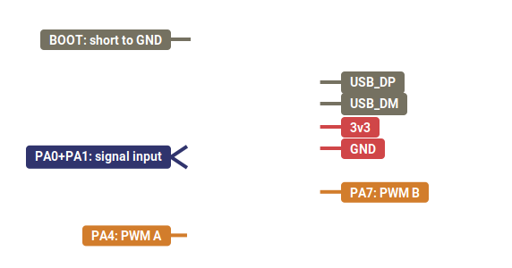
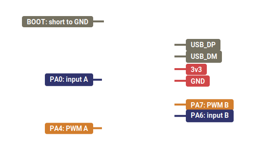
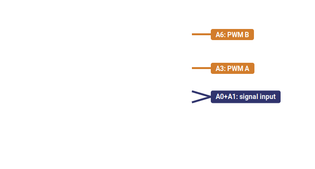
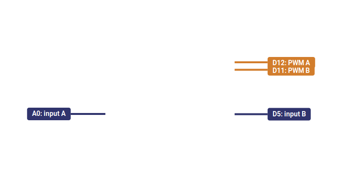

# STM32-based Virtual Frequency Counter: pin-outs

## STM32F042F6 (stand-alone)

### Pulse frequency measurement

### Period measurement

### Period + pulse width measurement

###  Frequency ratio measurement

## NUCLEO-F042K6

### Pulse frequency measurement

### Period measurement

### Period + pulse width measurement

###  Frequency ratio measurement

## NUCLEO-F303RE

### Pulse frequency measurement

### Period measurement

### Period + pulse width measurement

###  Frequency ratio measurement

